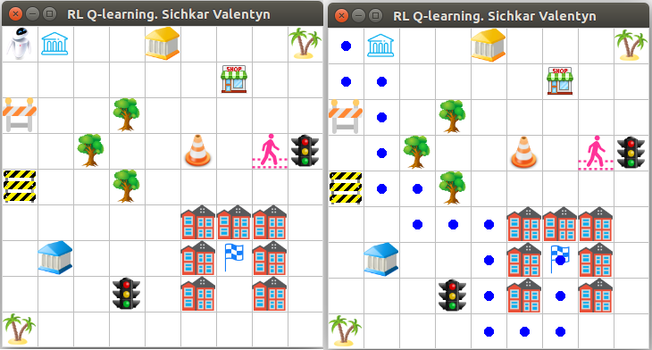
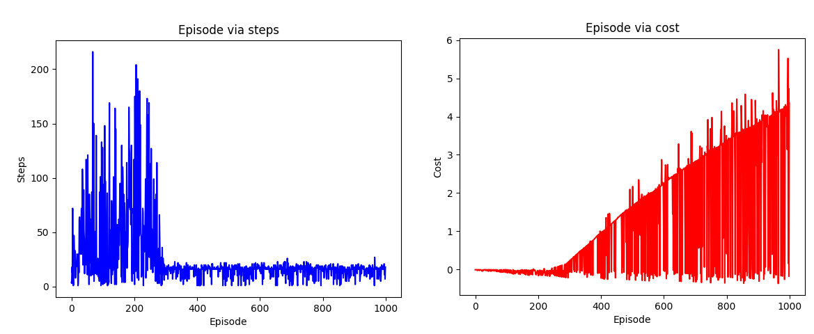
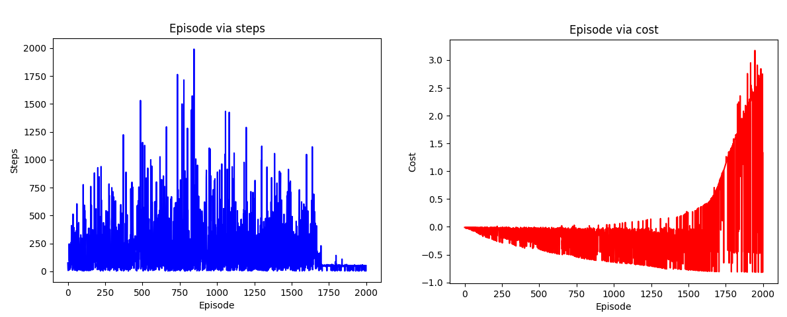
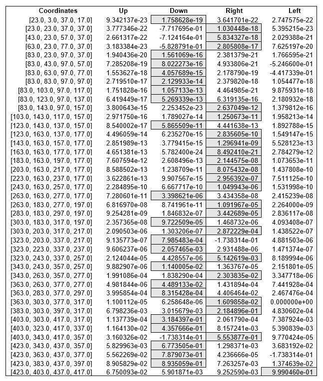
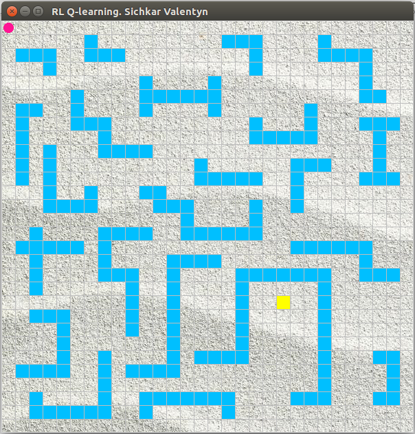

# Reinforcement Learning in Python
Implementing Reinforcement Learning Algorithms for global path planning of mobile robot

### Reference to:
[1] Valentyn N Sichkar. Reinforcement Learning Algorithms for global path planning // GitHub platform [Electronic resource]. URL: https://github.com/sichkar-valentyn/Reinforcement_Learning_in_Python (date of access: XX.XX.XXXX)

## Description
RL Algorithms implemented in Python for the task of global path planning for mobile robot.
 Experimental results with different Environments.
 Code is supported with a lot of comments. It will guide you step by step through entire idea of implementation.
 
 Each example consists of three files:
 env.py - building an environment with obstacles.
 agent_brain.py - implementation of algorithm itself.
 run_agent.py - running the experiments.

## Content
Codes:
* [RL_Q-Learning_E-1](https://github.com/sichkar-valentyn/Reinforcement_Learning_in_Python/tree/master/RL_Q-Learning_E1)
* [RL_Q-Learning_E-2](https://github.com/sichkar-valentyn/Reinforcement_Learning_in_Python/tree/master/RL_Q-Learning_E2)
* [RL_Q-Learning_E-3](https://github.com/sichkar-valentyn/Reinforcement_Learning_in_Python/tree/master/RL_Q-Learning_E3)
* [RL_Sarsa_E-1](https://github.com/sichkar-valentyn/Reinforcement_Learning_in_Python/tree/master/RL_Sarsa_E1)
* [RL_Sarsa_E-2](https://github.com/sichkar-valentyn/Reinforcement_Learning_in_Python/tree/master/RL_Sarsa_E2)

 
Experimental results:

* <a href="#RL Q-Learning Environment-1. Experimental results">RL Q-Learning Environment-1. Experimental results</a>
* <a href="#Q-learning algorithm resulted chart for the environment-1">Q-learning algorithm resulted chart for the environment-1</a>
* <a href="#Final Q-table with values from the final shortest route for environment-1">Final Q-table with values from the final shortest route for environment-1</a>
* <a href="#RL Q-Learning Environment-2. Experimental results">RL Q-Learning Environment-2. Experimental results</a>
* <a href="#Q-learning algorithm resulted chart for the environment-2">Q-learning algorithm resulted chart for the environment-2</a>
* <a href="#Final Q-table with values from the final shortest route for environment-1">Final Q-table with values from the final shortest route for environment-1</a>
* <a href="#RL Q-Learning Environment-3. Experimental results">RL Q-Learning Environment-3. Experimental results</a>
* <a href="#Comparison analysis of Q-Learning and Sarsa algorithms">Comparison analysis of Q-Learning and Sarsa algorithms</a>

 

### <a name="RL Q-Learning Environment-1. Experimental results">RL Q-Learning Environment-1. Experimental results</a>
Environment-1 with mobile robot, goal and obstacles

 

### <a name="Q-learning algorithm resulted chart for the environment-1">Q-learning algorithm resulted chart for the environment-1</a>
Represents number of episodes via number of steps and number of episodes via cost for each episode

### <a name="Final Q-table with values from the final shortest route for environment-1">Final Q-table with values from the final shortest route for environment-1</a>

 Looking at the values of the table we can see the decision for the next action made by agent (mobile robot). The sequence of final actions to reach the goal after the Q-table is filled with knowledge is the following: *down-right-down-down-down-right-down-right-down-right-down-down-right-right-up-up.*
 During the experiment with Q-learning algorithm the found shortest route to reach the goal for the environment-1 consist of 16 steps and the found longest rout to reach the goal consists of 185 steps.

 

### <a name="RL Q-Learning Environment-2. Experimental results">RL Q-Learning Environment-2. Experimental results</a>
Bigger environment-2 with more obstacles

### <a name="Q-learning algorithm resulted chart for the environment-2">Q-learning algorithm resulted chart for the environment-2</a>
Represents number of episodes via number of steps and number of episodes via cost for each episode

### <a name="Final Q-table with values from the final shortest route for environment-1">Final Q-table with values from the final shortest route for environment-1</a>

 

### <a name="RL Q-Learning Environment-3. Experimental results">RL Q-Learning Environment-3. Experimental results</a>
Super complex environment-3 with a lot of obstacles

 

### <a name="Comparison analysis of Q-Learning and Sarsa algorithms">Comparison analysis of Q-Learning and Sarsa algorithms</a>
_Released at June 21th_

## MIT License
## Copyright (c) 2018 Valentyn N Sichkar
## github.com/sichkar-valentyn
### Reference to:
[1] Valentyn N Sichkar. Reinforcement Learning Algorithms for global path planning // GitHub platform [Electronic resource]. URL: https://github.com/sichkar-valentyn/Reinforcement_Learning_in_Python (date of access: XX.XX.XXXX)
